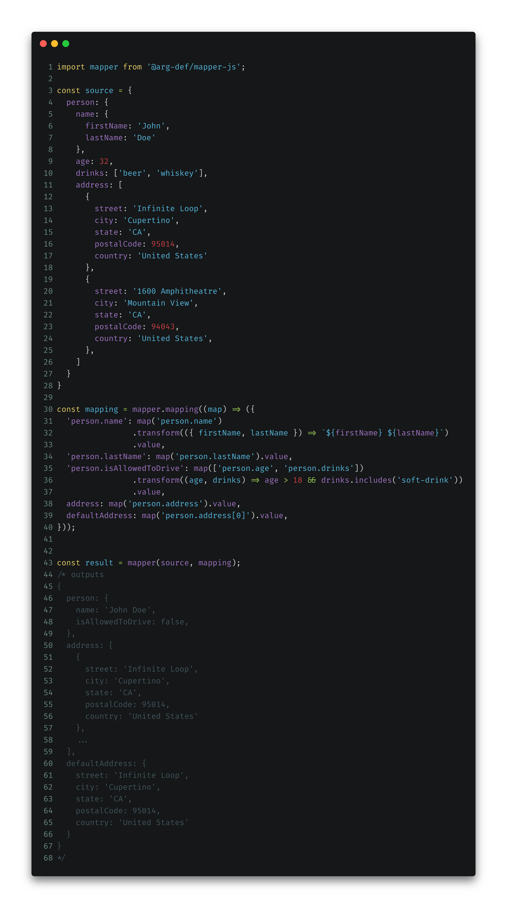

# @arg-def/mapper-js

> Fast, reliable and intuitive object mapping.

[![NPM Version][npm-image]][npm-url]
[![Build Status][circleci-image]][circleci-url]
[![Downloads Stats][npm-downloads]][npm-url]
[![GitHub stars][stars-image]][stars-url]
[![Known Vulnerabilities][vulnerabilities-image]][vulnerabilities-url]
[![GitHub issues][issues-image]][issues-url]
[![Awesome][awesome-image]][awesome-url]
[![install size][install-size-image]][install-size-url]
[![gzip size][gzip-size-image]][gzip-size-url]




## Installation

```sh
npm install @arg-def/mapper-js --save
#or
yarn add @arg-def/mapper-js
```

## How to use

### 1) Know the structure from your source data

Before we start, it is essential that we know your data structure
so we can map it accordingly.

For this demo case, let's assume that we have the following object:

```js
const source = {
  person: {
    name: {
      firstName: 'John',
      lastName: 'Doe'
    },
    age: 32,
    drinks: ['beer', 'whiskey'],
    address: [
      {
        street: 'Infinite Loop',
        city: 'Cupertino',
        state: 'CA',
        postalCode: 95014,
        country: 'United States'
      },
      {
        street: '1600 Amphitheatre',
        city: 'Mountain View',
        state: 'CA',
        postalCode: 94043,
        country: 'United States',
      },
    ]
  }
}
```


### 2) Create your mapping using dot notation

At this step, we need to create our `mapping` against our data `source`.

We will be using `dot notation` to create our `final structure`.

> For more info about `dot notation` API, check out the [documentation](https://github.com/arg-def/mapper-js)

With `mapper`, it is possible to `get` _one_ or _several_ values from our `source`
and even `transform` it in the way we need.

For that, `map.get()` accepts `single dot notation` path or
`an array of dot notation paths`. E.g.: `map.get('person.name.firstName')`, `map.get([person.name.firstName, person.name.lastName]);`'

Those values can be _transformed_ by using the `.transform()` method, which expects a `function` as argument and provides
the selected values as array in the `parameter`. 

> For more information about the usage, check the [API Documentation](#api-documentation).


Now let's create our `mapping`!

```js
import mapper from '@arg-def/mapper-js'

...

const mapping = mapper.mapping((map) => ({
  'person.name': map
                .get('person.name')
                .transform(([{ firstName, lastName }]) => `${firstName} ${lastName}`)
                .value,
  'person.lastName': map.get('person.lastName').value,
  'person.isAllowedToDrive': map.get(['person.age', 'person.drinks'])
  				.transform(([age, drinks]) => age > 18 && drinks.includes('soft-drink'))
  				.value,
  address: map.get('person.address').value,
  defaultAddress: map.get('person.address[0]').value,
}));
```


### 3) Create your mapped object

```js
import mapper from '@arg-def/mapper-js'
...

const result = mapper(source, mapping);
/* outputs 
{
  person: {
    name: 'John Doe',
    isAllowedToDrive: false,
  },
  address: [
    {
      street: 'Infinite Loop',
      city: 'Cupertino',
      state: 'CA',
      postalCode: 95014,
      country: 'United States'
    },
    ...
  ],
  defaultAddress: {
    street: 'Infinite Loop',
    city: 'Cupertino',
    state: 'CA',
    postalCode: 95014,
    country: 'United States'
  }
}
*/

```

# API Documentation

## mapper

**Type:** `function()`
**Parameter:** `source: object, mapping: IMapping, options?: IMapperOptions`
**Signature:** `(callback: (map: IMap) => IMapping): Function => callback`

**Description:** 

  `mapper()` mappes your _source data_ against your _mapping_.

  It accepts an extra (_optional_) argument defining the [_global mapping options_](#mapper-options).

Example:

```js
mapper(source, mapping, options);

/* outputs 
{
  employee: {
    name: 'John',
    age: 32,
    address: [
      {
        street: 'Infinite Loop',
        city: 'Cupertino',
        state: 'CA',
        postalCode: 95014,
        country: 'United States'
      },
      ...
    ],
  },
}
*/
```
___

## mapper.mapping

**Type**: `function()`
**Parameter**: `map`
**Signature:** `(callback: (map: IMap) => IMapping): Function => callback`

**Description:** 

  `mapper.mapping()` is the method responsible for mapping the _values_ from your _source data_ against your _object shape_.
  It accepts `dot notation` path as `key`.

Example:
```js
// raw definition
const mapping = mapper.mapping((map) => ({
    ...
}));

// with map() query
const mapping = mapper.mapping((map) => ({
  'employee.name': map.get('person.name.firstName').value,
  'employee.age': map.get('person.name.age').value,
  'employee.address': map.get('person.address').value,
}));


```
___


## map
**Type:** `object`

### Properties

#### `get`

**Type:** `function`
**Parameter:** `paths: string|string[], option?: IMapperOptions` 
**Signature:** `<T>(key: string | string[]) => IMap;`

**Description:** 

  `.get` method retrieves values from your _source data_ using `dot notation` path, it accepts a string or array of string.

  It accepts an extra (_optional_) argument to define the [_mapping options for current entry_](#mapper-options), _overriding_ the _global mapping options_.

Example:
```js
map.get('person.name.firstName');
map.get(['person.name.firstName', 'person.name.lastName']);
map.get(['person.name.firstName', 'person.name.lastName'], options);
```


#### `transform`

**Type:** `function`
**Parameter:** `any[]`
**Signature:** `<T, V>(callback: (values: T[]) => V) => IMap`

**Description:** 

  `.transform` method provides you the ability to _transform_ the retrieved values from `.get()` according to your needs, and for that, it expects a return value.

  `.transform` provides you as parameter, an `array` with the retrieved values in the **same order** as defined in the `get` method.

Example:
```js
// single value
map.get('person.name.firstName')
   .transform(([firstName]) => firstName.toLoweCase());

// multiple values
map.get(['person.name.firstName', 'person.name.lastName'])
   .transform(([firstName, lastName]) => `${firstName} ${lastName]`);
```


#### `value`

**Type:** `readonly`
**Returns:** `any | any[] | undefined | null`
**Description:** 

  `.value` returns the value of your `dot notation` query. If transformed, returns the transformed value.

Example:
```js
// single value
map.get('person.name.firstName')
   .transform(([firstName]) => firstName.toLoweCase())
   .value;

// multiple values
map.get(['person.name.firstName', 'person.name.lastName'])
   .transform(([firstName, lastName]) => `${firstName} ${lastName]`)
   .value;
```


## Mapper Options

### defaults

```js
{
  suppressNullUndefined: false,
  suppressionStrategy: () => false,
}
```

### Details

**`suppressNullUndefined`**

**Type:** `boolean`
**default value:** `false`

**Description:** 

  Removes `null` or `undefined` entries from the _mapped_ object.

Example:
```js
/* source object
{
  person: {
    name: 'John',
    lastName: 'Doe',
    age: 32,
  },
}
*/
const mapping = mapper.mapping((map) => ({
  'name': map.get('person.name').value,
  'age': map.get('person.age').value,
   // source doesn't have propery 'address',
   // therefore will return "undefined"
  'address': map.get('person.address').value,
}));

mapper(source, mapping, { suppressNullUndefined: true });
/* outputs 
{
  name: 'John',
  age: 32,
}
*/

```


**`suppressionStrategy`**

**Type:** `function`
**Parameter:** `value: unknown`
**Signature:** `(value: unknown) => boolean`

**Description:** 

  Defines a _custom strategy_ to suppress entries from the _mapped object_.

Example:
```js
/* source object
{
  person: {
    name: 'John',
    lastName: 'Doe',
    age: 32,
    addres: {
      street: 'Infinite Loop',
      city: 'Cupertino',
      state: 'CA',
      postalCode: 95014,
      country: 'United States',
    }
  },
}
*/

const customSuppressionStrategy = (address: ISource): boolean => address && address.city === 'Cupertino';

const mapping = mapper.mapping((map) => ({
  'name': map.get('person.name').value,
  'age': map.get('person.age').value,
   // source doesn't have propery 'address',
   // therefore will return "undefined"
  'address': map.get('person.address').value,
}));

mapper(source, mapping, { suppressionStrategy: customSuppressionStrategy );
/* outputs 
{
  name: 'John',
  age: 32,
}
*/

```


<!-- Markdown link & img dfn's -->

[npm-image]: https://img.shields.io/npm/v/@arg-def/mapper-js.svg?style=flat-square
[npm-url]: https://npmjs.org/package/@arg-def/mapper-js
[npm-downloads]: https://img.shields.io/npm/dm/@arg-def/mapper-js.svg?style=flat-square
[circleci-image]: https://circleci.com/gh/arg-def/mapper-js.svg?style=svg
[circleci-url]: https://circleci.com/gh/arg-def/mapper-js
[stars-image]: https://img.shields.io/github/stars/arg-def/mapper-js.svg
[stars-url]: https://github.com/arg-def/mapper-js/stargazers
[vulnerabilities-image]: https://snyk.io/test/github/arg-def/mapper-js/badge.svg
[vulnerabilities-url]: https://snyk.io/test/github/arg-def/mapper-js
[issues-image]: https://img.shields.io/github/issues/arg-def/mapper-js.svg
[issues-url]: https://github.com/arg-def/mapper-js/issues
[awesome-image]: https://cdn.rawgit.com/sindresorhus/awesome/d7305f38d29fed78fa85652e3a63e154dd8e8829/media/badge.svg
[awesome-url]: https://github.com/themgoncalves/react-loadable-ssr-addon
[install-size-image]: https://packagephobia.now.sh/badge?p=@arg-def/mapper-js
[install-size-url]: https://packagephobia.now.sh/result?p=@arg-def/mapper-js
[gzip-size-image]: http://img.badgesize.io/https://unpkg.com/@arg-def/mapper-js/lib/mapper-js.min.js?compression=gzip
[gzip-size-url]: https://unpkg.com/@arg-def/mapper-js/lib/mapper-js.min.js
